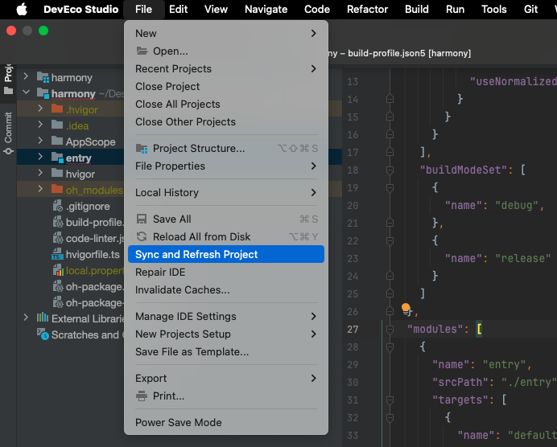
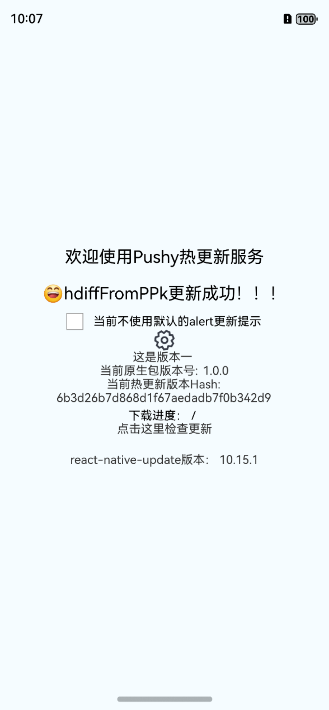

## 运行harmony_use_pushy项目步骤

### 1.将项目克隆到本地后在项目根目录创建libs文件夹。

### 2.然后将[`rnoh`](https://github.com/bozaigao/rnoh)克隆到libs文件夹中。

说明：rnoh项目基于react-native 0.72.5版本适配，如果使用最新的RN版本可能会报错，项目适配RN新版本请关注[`gitee仓库`](https://gitee.com/openharmony-sig/ohos_react_native/tree/0.72.5-ohos-5.0-release/tester/harmony/react_native_openharmony/src/main)

### 3.进入rnoh项目执行下面命令对rnoh项目依赖的C++库进行初始化；
```
git submodule update --init --recursive
```

### 4. 确保在react-native-update根目录已经执行过yarn submodule命令。
说明：这个命令会在harmony/src/main/cpp目录生成HDiffPatch和lzma的C++模块依赖。

### 5. 在项目根目录执行下面命令安装第三方依赖。
```
yarn install
```

### 6. 使用DevEco Studio IDE打开harmony目录然后执行sync运行项目


### 6 运行效果图
